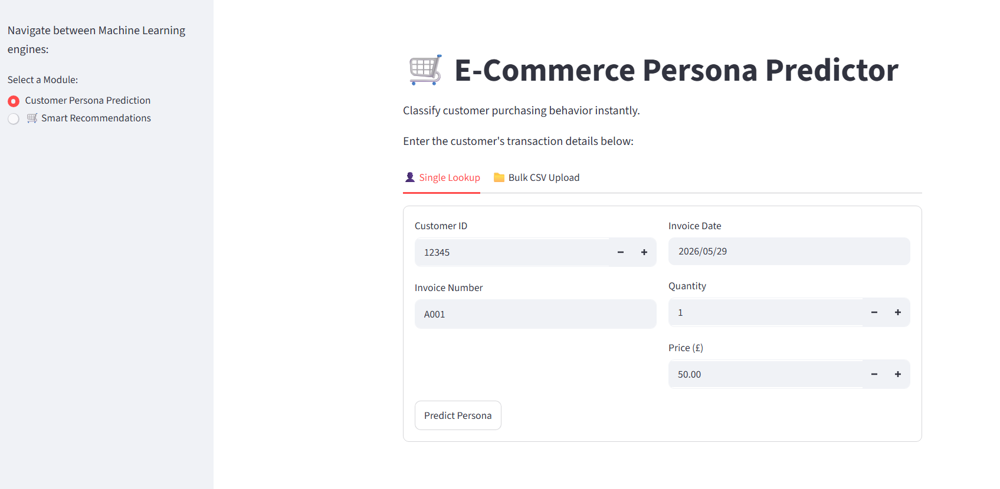
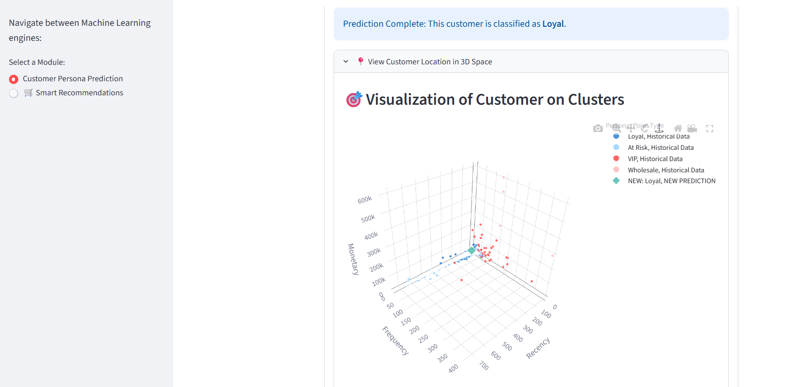
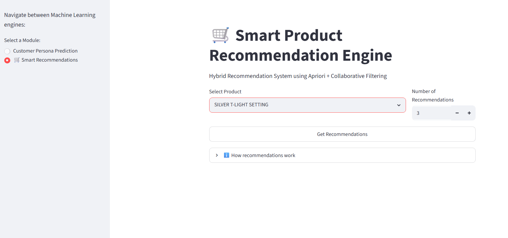
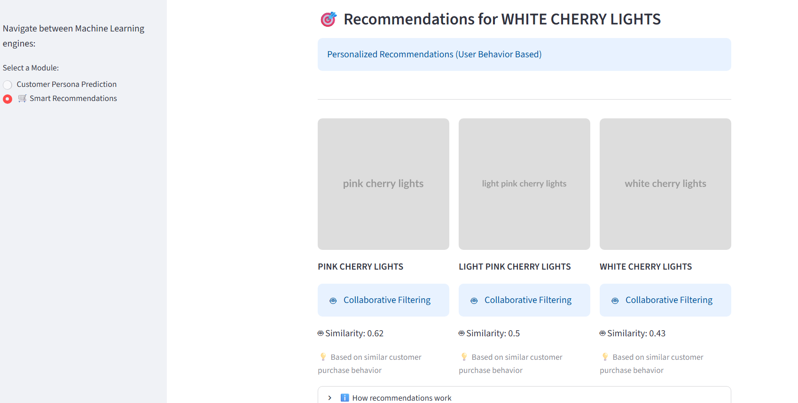
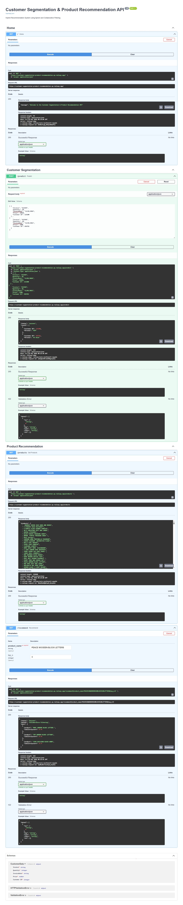

# Customer Segmentation & Product Recommendation System

## Overview

An end-to-end Machine Learning application that combines Customer Segmentation and Product Recommendation to help businesses understand customer behavior and deliver personalized product suggestions.

The system implements:

* K-Means Clustering for Customer Segmentation
* Apriori Algorithm for Association Rule Mining
* Collaborative Filtering using Cosine Similarity
* Hybrid Product Recommendation System
* FastAPI Backend Services
* Streamlit Interactive Frontend
* Dockerized Cloud Deployment

---

## Live Applications

### Streamlit Frontend

https://customer-segmentation-and-recommendation-model.streamlit.app/

### FastAPI Backend Documentation

https://customer-segmentation-product-recommendation.up.railway.app/docs

---

## Project Architecture

Customer Data
↓
Data Preprocessing & Feature Engineering
↓
Customer Segmentation (K-Means Clustering)
↓
Customer Segment Prediction
↓
Hybrid Recommendation Engine
├── Apriori Association Rules
└── Collaborative Filtering (Cosine Similarity)
↓
Personalized Product Recommendations

---

## Features

### Customer Segmentation

* Data preprocessing and feature engineering
* K-Means clustering model
* Customer behavior analysis
* Real-time customer segment prediction
* Interactive visualization and prediction interface

### Product Recommendation

* Market Basket Analysis using Apriori Algorithm
* Association Rule Mining
* Collaborative Filtering Recommendation System
* Cosine Similarity-Based Product Matching
* Product-to-Product Recommendation Engine
* Personalized Product Suggestions
* Hybrid Recommendation Approach

### API Services

* FastAPI REST API
* Swagger API Documentation
* JSON-based responses
* Production-ready backend services

### Deployment

* Dockerized Application
* Railway Cloud Deployment
* Streamlit Cloud Deployment
* GitHub Version Control

---

## Tech Stack

### Programming Language

* Python

### Machine Learning

* Scikit-Learn
* K-Means Clustering
* Apriori Algorithm
* Association Rule Mining
* Collaborative Filtering
* Cosine Similarity

### Backend

* FastAPI
* Pydantic
* Uvicorn

### Frontend

* Streamlit

### Data Processing

* Pandas
* NumPy

### Visualization

* Plotly

### Deployment & DevOps

* Docker
* Railway
* Streamlit Cloud
* GitHub

---

## Project Structure

```text
Customer-Segmentation-and-Recommendation-System
│
├── appui.py
├── main.py
├── Dockerfile
├── requirements.txt
├── README.md
│
├── customer_segmentation/
│   ├── customer_segmentation.pkl
│   ├── Customer_Segmentation_Final.csv
│   ├── ETL_transformer.py
│   ├── model_loader.py
│   └── schema.py
│
├── Recommendation_system/
│   ├── recommendation_model.py
│   ├── apriori_bestrules.csv
│   ├── itemsimilarity_df.parquet
│   └── useritem_matrix.parquet
│
├── notebooks/
│   ├── customer_segmentation.ipynb
│   └── recommendation_system.ipynb
│
└── images/
    ├── segmentaion_ui.png
    ├── segmentation_predictions_ui.png
    ├── product_recommendation_ui.png
    ├── product_recommendation_prediction_ui.png
    └── swagger_api.jpeg
```
---
## Dataset Information

The original training datasets are not included in this repository due to their large size and GitHub storage limitations.

### Dataset Used

**Online Retail II UCI Dataset**

Dataset Source:
https://www.kaggle.com/datasets/mashlyn/online-retail-ii-uci

### Dataset Description

The Online Retail II dataset contains transactional data from a UK-based online retail store. The dataset includes:

* Customer IDs
* Invoice Numbers
* Product Descriptions
* Quantity Purchased
* Unit Prices
* Transaction Dates
* Country Information

The dataset was used for:

* Customer Segmentation using K-Means Clustering
* Market Basket Analysis
* Apriori Association Rule Mining
* Collaborative Filtering using Cosine Similarity
* Product Recommendation System Development

### Repository Contents

This repository includes:

* Trained Machine Learning Models
* Recommendation Artifacts
* Feature Engineering Pipeline
* Deployment-Ready Application Code
* API Services
* Frontend Interface

The original datasets have been excluded to keep the repository lightweight and focused on deployment and reproducibility.

To reproduce the training process, download the dataset from the source link above and place it in the appropriate project directory.
---

## Application Screenshots

### Customer Segmentation Interface



### Customer Segmentation Prediction



### Product Recommendation Interface



### Product Recommendation Prediction



### FastAPI Swagger Documentation



---

## Machine Learning Workflow

### Customer Segmentation Pipeline

1. Data Collection
2. Data Cleaning
3. Feature Engineering
4. Feature Scaling
5. K-Means Clustering
6. Customer Segment Prediction

### Recommendation Pipeline

1. Transaction Data Processing
2. User-Item Matrix Creation
3. Market Basket Analysis
4. Apriori Algorithm
5. Association Rule Generation
6. Cosine Similarity Computation
7. Collaborative Filtering
8. Product Recommendation Generation

---

## Recommendation System Architecture

### Association Rule-Based Recommendation

* Built using Apriori Algorithm
* Generates frequent itemsets
* Creates association rules
* Produces product recommendations from transaction patterns

### Collaborative Filtering

* User-Item Matrix Generation
* Product Similarity Computation
* Cosine Similarity-Based Recommendation
* Item-to-Item Recommendation Engine

### Hybrid Recommendation Approach

Combines:

* Association Rule Mining
* Collaborative Filtering
* Product Similarity Analysis

to improve recommendation quality and relevance.

---

## API Endpoints

### Health Check

GET /

Returns API status.

### Customer Segmentation

POST /predict

Predicts customer segment based on customer attributes.

### Product Recommendation

POST /recommend

Returns recommended products using the hybrid recommendation engine.

---

## Running Locally

### Clone Repository

```bash
git clone https://github.com/Kushal-kush1/Customer-Segmentation-and-Recommendation-System.git

cd Customer-Segmentation-and-Recommendation-System
```

### Install Dependencies

```bash
pip install -r requirements.txt
```

### Run FastAPI Backend

```bash
uvicorn main:app --reload
```

### Run Streamlit Frontend

```bash
streamlit run appui.py
```

### Docker Deployment

```bash
docker build -t customer-segmentation .

docker run -p 8000:8000 customer-segmentation
```

---

## Business Value

* Identifies customer groups based on purchasing behavior
* Enables targeted marketing campaigns
* Improves customer retention strategies
* Supports cross-selling and upselling
* Delivers personalized product recommendations
* Helps businesses make data-driven decisions

---

## Key Highlights

* End-to-End Machine Learning Project
* Customer Segmentation using K-Means Clustering
* Product Recommendation using Apriori Algorithm
* Collaborative Filtering using Cosine Similarity
* Hybrid Recommendation System
* FastAPI Backend
* Streamlit Frontend
* Dockerized Deployment
* Railway Cloud Hosting
* Streamlit Cloud Hosting
* Production API Documentation
* GitHub Version Control

---

## Future Improvements

* Real-Time Recommendation Engine
* User Authentication
* Database Integration
* MLflow Experiment Tracking
* CI/CD Automation
* Cloud Monitoring and Logging
* Recommendation Performance Optimization

---

## Author

### Kushal K N

Electronics & Communication Engineering Graduate

Executive Program in Data Science & AI
(E&ICT Academy IIT Guwahati × Learnbay)

Passionate about Data Analytics, Machine Learning, Artificial Intelligence, Recommendation Systems, and solving real-world business problems through data.

